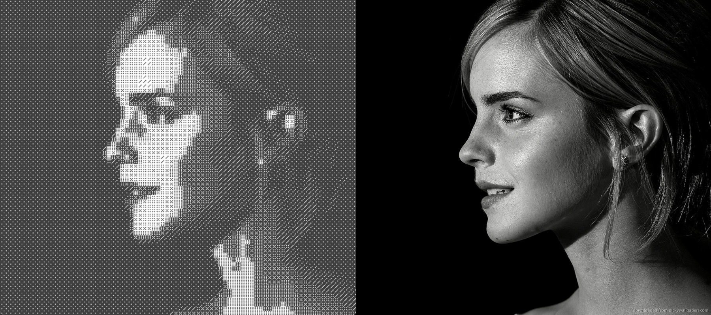

# Image2Mosaic — Photomosaic Generation

A simple tool to generate different kinds of mosaics and render them using goopylib.

### Dice Mosaics



## How to run?

Clone this repository, install the requirements using pip by running:

```terminal
pip install -r requirements.txt
```

Add your own images to convert to mosaics in `/demo` and supply the file path in `main.py`. Then, run the code!
